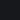
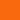
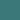
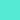
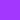
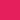
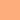
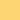
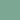
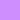

# Ambitopia Palette

The Ambitopia design system is built around a dark color palette with high-contrast accent colors, and muted versions of the primary colors for use in syntax highlighting. The palette is designed with a nod to a cyberpunk aesthetic.

## Typography

### Interface Font
- **Barlow** - Primary interface font ([GitHub](https://github.com/jpt/barlow))

### Code Font
- **SpaceMono Nerd Font** - Monospace font with icon support ([GitHub](https://github.com/ryanoasis/nerd-fonts/))

### Display Font
- **Ndot 57** - Dot matrix display font used for branding and widget day-of-week ([GitHub](https://github.com/xeji01/nothingfont))

## Core Colors

### Backgrounds

-  `#030408` - Primary background
-  `#17181c` - Secondary background
-  `#2e2f32` - Tertiary background

### Text
-  `#e3e3e3` - Primary text
-  `#ffffff` - Headings and highlights

## Accent Colors

### Yellow Variant
-  `#fdf400` - Primary accent (UI elements)

### Red Variant
-  `#f22613` - Primary accent (UI elements)

### Secondary Colors

-  `#c5003c` - Red (UI elements)
-  `#f9690e` - Orange (UI elements)
-  `#397979` - Green (UI elements)
-  `#55ead4` - Cyan (UI elements)
-  `#385a8c` - Blue (UI elements)
-  `#a537fd` - Purple (UI elements)

## Syntax Colors

-  `#e61e5b` - Red (Keywords, control flow, errors)
-  `#fcad7b` - Orange (Markup underline, JSON level 4)
-  `#fcd670` - Yellow (Strings, variables, constants ) 
-  `#7ca893` - Green (HTML attributes, headings, insertions)
-  `#89b9e1` - Blue (Functions, methods, tags, operators)
-  `#cd8ffe` - Purple (CSS properties, decorators, markup)

## Accessibility Notes

Most accent colors meet WCAG AA contrast requirements against the dark backgrounds, but the goal of this project was to meet my specific needs, so some of them only meet my requirements.
