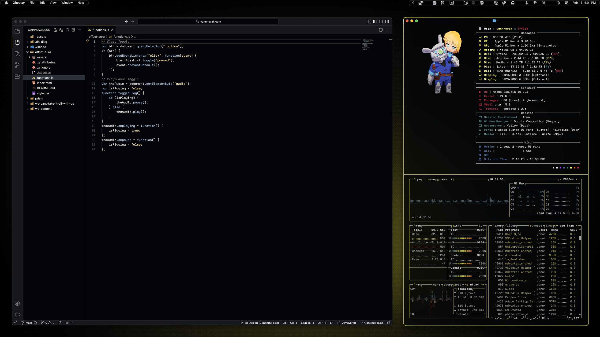
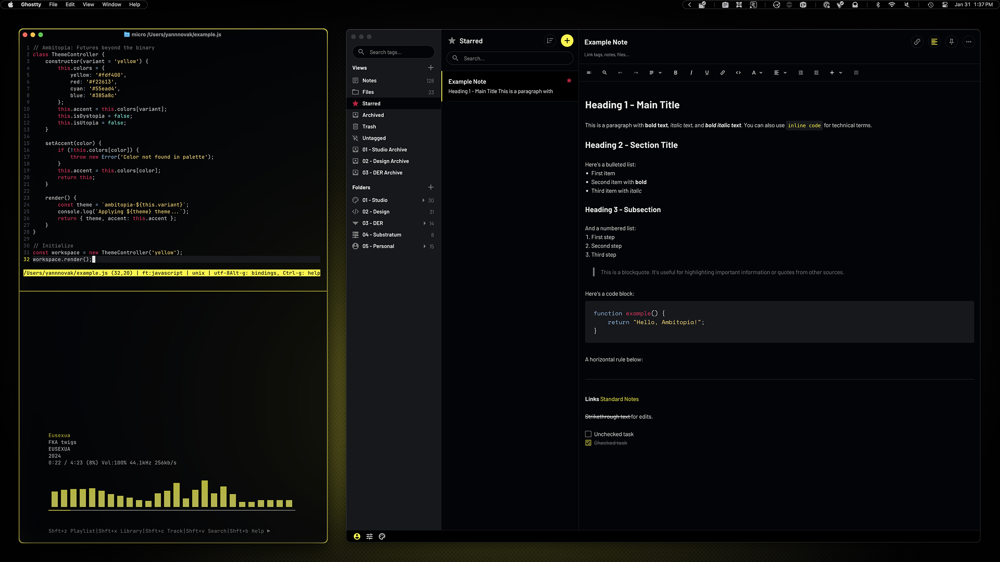
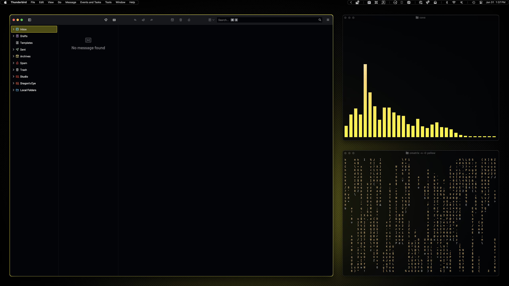
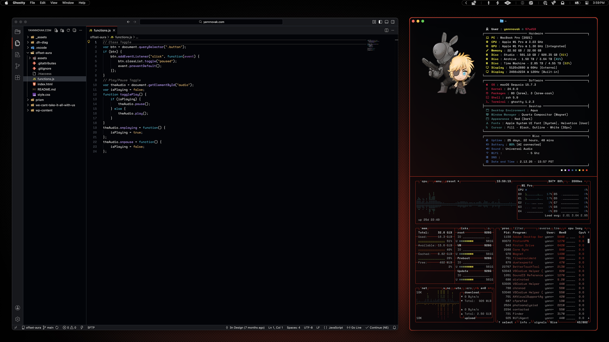
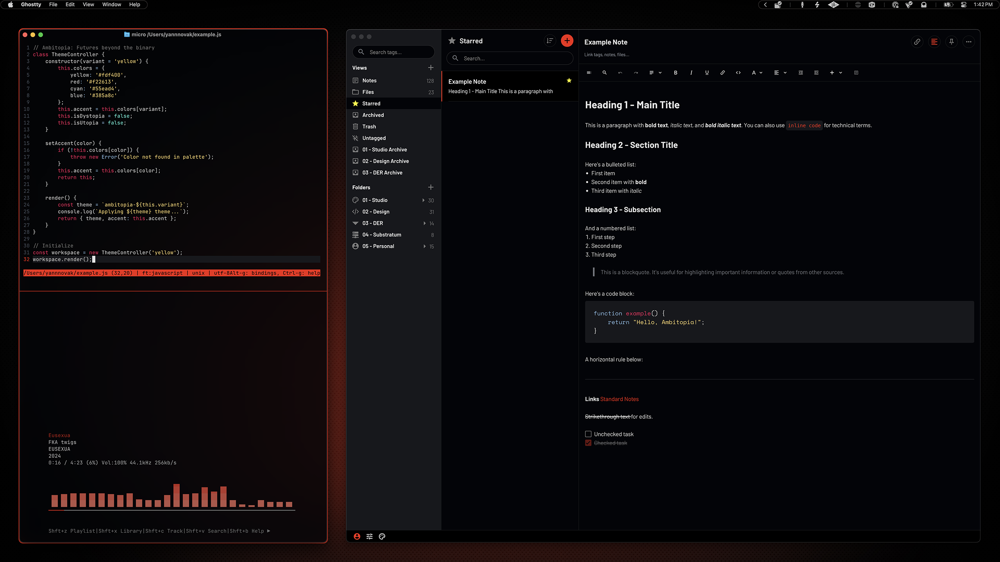
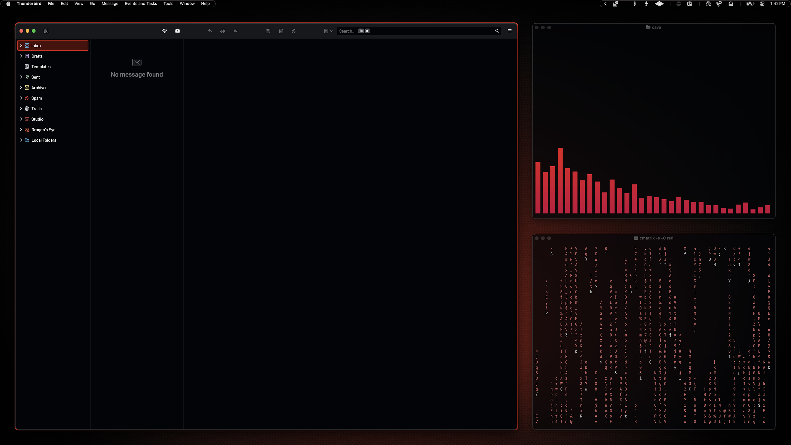

# Ambitopia

A modular design system of dotfiles and themes for macOS featuring a dark palette with yellow and red accent color variants.

## Showcase

### Yellow Variant



<p align="center">
    VSCodium, Fastfetch, Btop
</p>
<br>



<p align="center">
    Micro, Kew, Standard Notes
</p>
<br>



<p align="center">
    Thunderbird, Cava, Cmatrix
</p>
<br>

### Red Variant



<p align="center">
    VSCodium, Fastfetch, Btop
</p>
<br>



<p align="center">
    Micro, Kew, Standard Notes
</p>
<br>



<p align="center">
    Thunderbird, Cava, Cmatrix
</p>

## What's Inside

* **Two color variants** - Yellow for focus work, red for creative work
* **10+ themed applications** - Terminal, editor, browser, system monitor, and more
* **Modular approach** - Use the full setup or pick individual themes à la carte
* **Beginner-friendly documentation** - Step-by-step installation guides for macOS users
* **Cross-platform compatible** - All themes work on other operating systems

## About Ambitopia

Ambitopia is a design system expressed through dotfiles and themes for macOS and built around a [dark palette](PALETTE.md) that caters to my accessibility needs with a nod to a cyberpunk aesthetic. I'm partially colorblind and dyslexic—for me, dark backgrounds with bright accent colors help me quickly locate important elements. I've used Ambitopia in relation to my work before; it's a term coined by Redfern Jon Barrett to describe [possible futures beyond the binary](https://vector-bsfa.com/2023/08/07/ambitopia-futures-beyond-the-binary/) of utopia and dystopia.

It felt fitting as a title when I was thinking through my motivation for creating this design system: it was a response to Apple introducing liquid glass. When I saw it, I immediately knew I'd have a problem. The translucent, low-contrast aesthetic wasn't just difficult for me as someone with accessibility needs—it felt oppressive. It's so specific that it leaves no room to make it your own; it only allows different flavors of liquid glass. So I started this project as an experiment: how much of my computer could I reclaim? How much control would Apple actually allow me to have over my own workspace?

The resulting design system exists in the space between accepting Apple's imposed aesthetics and fully rejecting their ecosystem. In those terms, the cyberpunk influence isn't just visual flair; it reflects the underlying tension between corporate control and individual expression—it's about creating a space of autonomy within systems designed to limit them.

The two color variants serve different sides of my creative practice. Yellow is used on my desktop where I do office and development work. Red is used on my laptop, which is almost exclusively for music production in the studio. Each environment gets its own accent color that greatly sways its feel in one direction or the other, while maintaining the core Ambitopia design system.

## Dotfiles, Themes, & Assets

### Dotfiles

- [btop](dotfiles/btop/README.md) - System monitor
- [cava](dotfiles/cava/README.md) - Audio visualizer
- [Fastfetch](dotfiles/fastfetch/README.md) - System info
- [Ghostty](dotfiles/ghostty/README.md) - Terminal emulator
- [JankyBorders](dotfiles/borders/README.md) - Window borders
- [Kew](dotfiles/kew/README.md) - Terminal music player
- [Micro](dotfiles/micro/README.md) - Text editor

### Themes

- [Live](themes/live/README.md) - Digital audio workstation
- [Raycast](themes/raycast/README.md) - App launcher
- [Slack](themes/slack/README.md) - Messaging app
- [Standard Notes](themes/standard-notes/README.md) - Note-taking app
- [Thunderbird](themes/thunderbird/README.md) - Mail client
- [Vivaldi](themes/vivaldi/README.md) - Browser
- [VSCode/VSCodium](themes/vscode/README.md) - Editor

### Desktop
- [DateTime Widget](desktop/widgets/datetime/README.md) - Date and time display
- [Wallpaper](desktop/wallpaper/README.md) - Desktop background images

## Installation

**Getting started:** Follow the [Installation Guide](INSTALL.md) for complete setup instructions.

**Modular installation:** See individual app READMEs for standalone setup—use what you need, skip the rest.

## Related Projects

Standalone theme repositories that work with Ambitopia:

- [Standard Notes (Yellow)](https://github.com/yannnovak/sn-ambitopia-yellow-theme) - Note-taking app theme
- [Standard Notes (Red)](https://github.com/yannnovak/sn-ambitopia-red-theme) - Note-taking app theme

## Roadmap

**Planned**
- [ ] Obsidian - Note-taking and knowledge base
- [ ] BetterDiscord - Discord theming

**Under Consideration**
- [ ] Yazi - Terminal file manager
- [ ] Newsboat - RSS reader
- [ ] Blue variant

## Inspiration

- [Redfern Jon Barrett](https://vector-bsfa.com/2023/08/07/ambitopia-futures-beyond-the-binary/) - For coining a term that has been so useful for describing where my work lives
- [Cybrland](https://github.com/scherrer-txt/cybrland) - Recently discovered system that got me to put this all together in a more professional way

## Repository Structure
```
ambitopia/
├── assets/
│   ├── banner.gif
│   ├── palette/          # Color swatches
│   ├── screenshots/      # Individual app screenshots
│   ├── showcase/         # Grouped app compositions
│   └── thumbnails/       # Wallpaper thumbnails
├── desktop/
│   ├── wallpaper/
│   │   ├── 3456x2234/    # Laptop resolutions
│   │   └── 5120x2880/    # Desktop resolutions
│   └── widgets/
│       └── datetime/     # Date/time widget
├── dotfiles/
│   ├── borders/          # Window borders
│   ├── btop/             # System monitor
│   ├── cava/             # Audio visualizer
│   ├── fastfetch/        # System info
│   ├── ghostty/          # Terminal emulator
│   ├── kew/              # Music player
│   └── micro/            # Terminal text editor
├── themes/
│   ├── live/             # DAW
│   ├── raycast/          # App launcher
│   ├── slack/            # Messaging app
│   ├── standard-notes/   # Note-taking app
│   ├── thunderbird/      # Mail client
│   ├── vivaldi/          # Browser
│   └── vscode/           # Code editor
├── PALETTE.md
├── INSTALL.md
└── README.md
```
