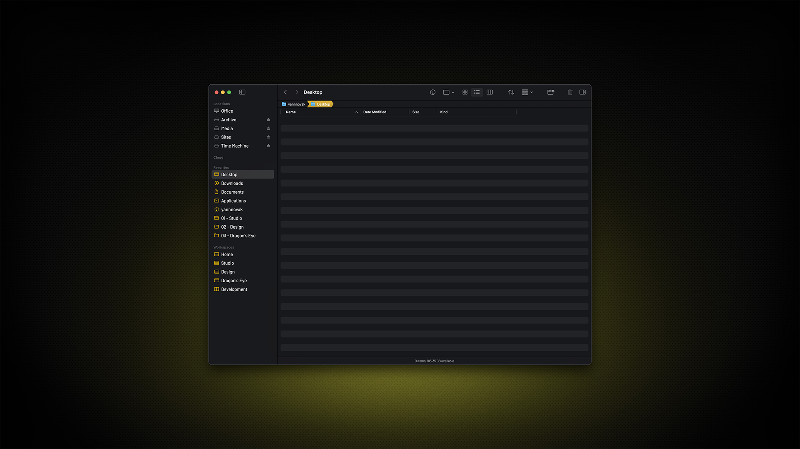
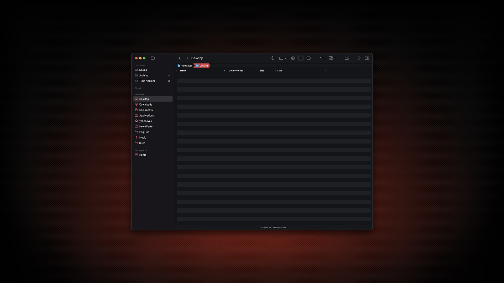

# Bloom

I replaced Finder with Bloom mostly to get away from liquid glass when I am working outside the terminal. It can't be fully themed, but a few settings get it close. This requires a paid subscription.

## Preview



<p align="center">
    Yellow Variant
</p>
<br>



<p align="center">
    Red Variant
</p>

## Installation

### 00. Before you start
- Make sure Homebrew is installed ([install here](https://brew.sh))
- If you skipped the Installation Guide, install Barlow (instructions [here](../../INSTALL.md)) or follow the whole [Installation Guide](../../INSTALL.md)
- [Bloom](https://bloomapp.club)

### 01. Install Bloom
```sh
brew install --cask bloom
```

### 02. Configure appearance

Open Bloom Settings → Appearance, then set the following:

**Theme Color:** `#17181c`

**Sidebar Background:** `#030408`

**Font:** Barlow

### 03. Apply

The changes take effect immediately.

> [!NOTE]
> - Bloom can't be fully themed, but if you followed the [Installation Guide](../../INSTALL.md) it will take on your macOS Accent and Highlight colors, which gets it closer.
