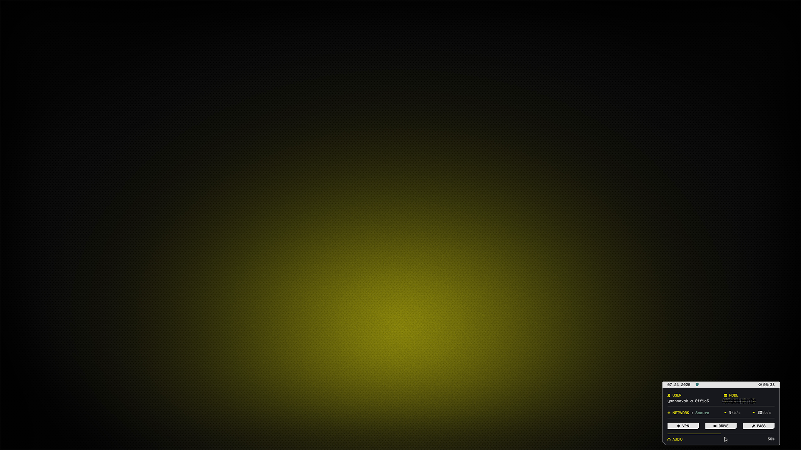
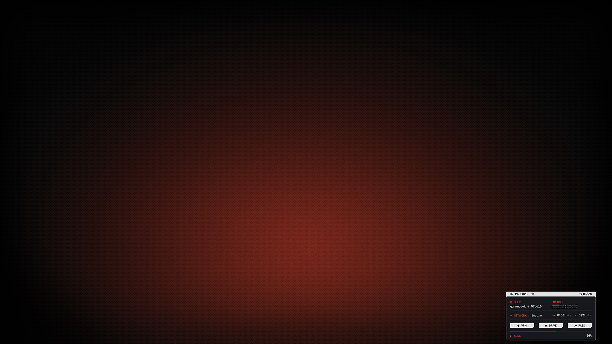

# Status Widget

I have my menu bar hidden in macOS, but I still wanted a few things visible, like the time and VPN status. So I cobbled together this mess of a widget for Übersicht. I often have the right 1/3 of my desktop visible as a work area, so it's *usually* visible.

## Preview


<p align="center">
    Yellow Variant (closed)
</p>
<br>



<p align="center">
    Yellow Variant (open)
</p>
<br>


<p align="center">
    Red Variant (closed)
</p>
<br>



<p align="center">
    Red Variant (open)
</p>

## Installation

### 00. Before you start
- Make sure Homebrew is installed ([install here](https://brew.sh))
- If you skipped the Installation Guide, install Micro, SpaceMono Nerd Font and Barlow (instructions [here](../../../INSTALL.md)) or follow the whole [Installation Guide](../../../INSTALL.md)
- [Übersicht Website](https://tracesof.net/uebersicht/)

### 01. Install Übersicht
```sh
brew install --cask ubersicht
```

### 02. Copy widget file

Choose your variant:

**For yellow variant:**
```sh
cp desktop/widgets/status/ambitopia-status-yellow.jsx ~/Library/Application\ Support/Übersicht/widgets/
```

**For red variant:**
```sh
cp desktop/widgets/status/ambitopia-status-red.jsx ~/Library/Application\ Support/Übersicht/widgets/
```

### 03. Edit the config block

Open the widget file you just copied:

**For yellow variant:**
```sh
micro ~/Library/Application\ Support/Übersicht/widgets/ambitopia-status-yellow.jsx
```

**For red variant:**
```sh
micro ~/Library/Application\ Support/Übersicht/widgets/ambitopia-status-red.jsx
```

At the top of the file there's a config block. Change `VPN_SUBNET` to your own VPN's tunnel subnet, and edit the three buttons to point at the apps and folders you want:

```jsx
const VPN_SUBNET = '10.2.0.'   // your VPN tunnel's subnet prefix
const BUTTONS = [
    { icon: '󰒘', label: 'VPN',   cmd: 'open -a "ProtonVPN"' }, // add your VPN here
    { icon: '', label: 'Drive', cmd: 'open "/path/to/your/folder"' }, // add the path to your cloud storage here
    { icon: '', label: 'Pass',  cmd: 'open -a "Proton Pass"' }, // add your Password Manager here
]
```

Save and close the file.

### 04. Enable your variant

Click the Übersicht menu bar icon and you'll see the widget listed. Enable the one you chose if it's not already enabled:

- **For yellow variant:** Enable `ambitopia-status-yellow.jsx`
- **For red variant:** Enable `ambitopia-status-red.jsx`

### 05. Position the widget

Click the Übersicht menu bar icon, find your widget, then select → **Send to Main Display** (if using multiple monitors)

The widget will now display in the bottom-right of your screen, and expands on hover.

> [!NOTE]
> - The widget runs a shell command every 10 seconds to read network and volume state. Everything it runs is visible at the top of the file if you want to check it first.
> - It detects your Wi-Fi interface automatically, so it should work whether yours is `en0` or `en1`.