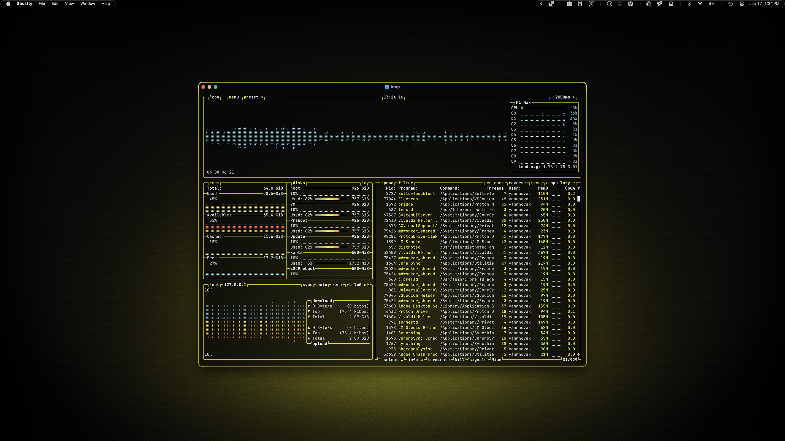
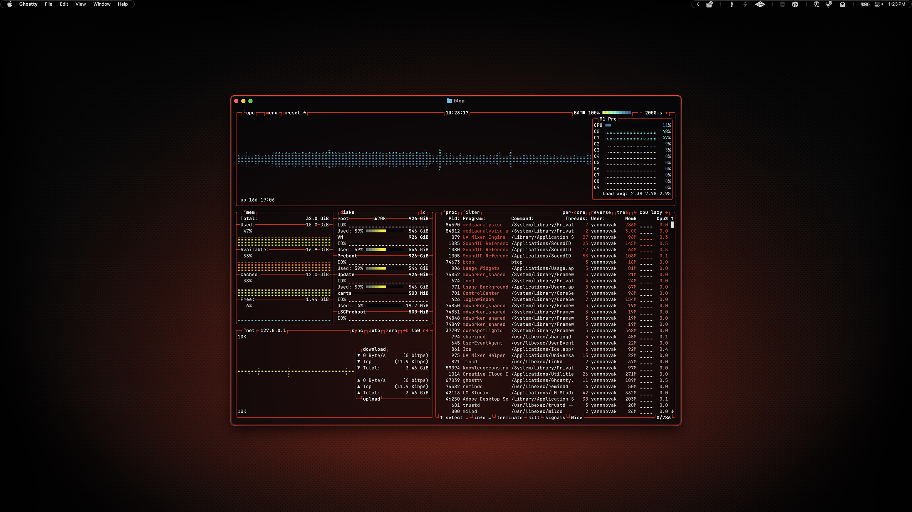

# btop

I based my theme on one of the included themes, but I changed every color, so its only relation to the original is the section headers—and even those I changed to match the larger system.

## Preview



<p align="center">
    Yellow Variant
</p>
<br>



<p align="center">
    Red Variant
</p>

## Installation

### 00. Before you start
- Make sure Homebrew is installed ([install here](https://brew.sh))
- If you skipped the Installation Guide, install Micro (instructions [here](../../INSTALL.md)) or follow the whole [Installation Guide](../../INSTALL.md)
- [btop GitHub](https://github.com/aristocratos/btop)

### 01. Install btop
```sh
brew install btop
```

### 02. Create config directories
```sh
mkdir -p ~/.config/btop/themes
```

### 03. Copy theme file

Choose your variant:

**For yellow variant:**
```sh
cp dotfiles/btop/ambitopia-yellow.theme ~/.config/btop/themes/
```

**For red variant:**
```sh
cp dotfiles/btop/ambitopia-red.theme ~/.config/btop/themes/
```

### 04. Create config file

**For yellow variant:**
```sh
echo 'color_theme = "ambitopia-yellow"' > ~/.config/btop/btop.conf
```

**For red variant:**
```sh
echo 'color_theme = "ambitopia-red"' > ~/.config/btop/btop.conf
```

### 05. Launch btop
```sh
btop
```