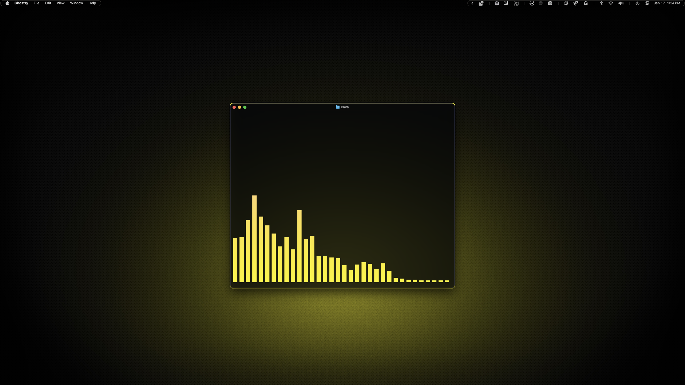
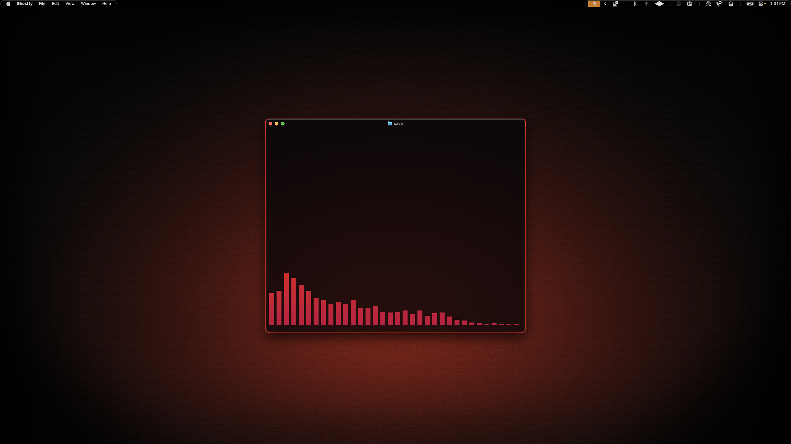

# Cava

I almost didn't include this because it's so fiddly for the Mac, but I was already finished and it took no time to complete, so I included it anyway.

## Preview



<p align="center">
    Yellow Variant
</p>
<br>



<p align="center">
    Red Variant
</p>

## Installation

### 00. Before you start
- Make sure Homebrew is installed ([install here](https://brew.sh))
- If you skipped the Installation Guide, install Micro (instructions [here](../../INSTALL.md)) or follow the whole [Installation Guide](../../INSTALL.md)
- [Cava GitHub](https://github.com/karlstav/cava)

### 01. Install Cava
```sh
brew install cava
```

### 02. Create config directory
```sh
mkdir -p ~/.config/cava/themes
```

### 03. Launch cava to create config file
```sh
cava
```

### 04. Close cava

Press <kbd>Ctrl</kbd>+<kbd>C</kbd> or <kbd>Q</kbd> to exit.

### 05. Copy theme file

Choose your variant:

**For yellow variant:**
```sh
cp dotfiles/cava/ambitopia-yellow ~/.config/cava/themes/
```

**For red variant:**
```sh
cp dotfiles/cava/ambitopia-red ~/.config/cava/themes/
```

### 06. Set your theme variant

Open the config file:
```sh
micro ~/.config/cava/config
```

Find the `theme` line and change it to your preferred variant:

**For yellow variant:**
```
theme = 'ambitopia-yellow'
```

**For red variant:**
```
theme = 'ambitopia-red'
```

Save and close the file.

### 07. Run Cava
```sh
cava
```

> [!WARNING]
> Cava on macOS has some limitations compared to Linux. You will need to install a loopback device - there are detailed instructions with a few options [here](https://github.com/karlstav/cava). Once you choose one, you will need to configure your audio source manually in the config file.