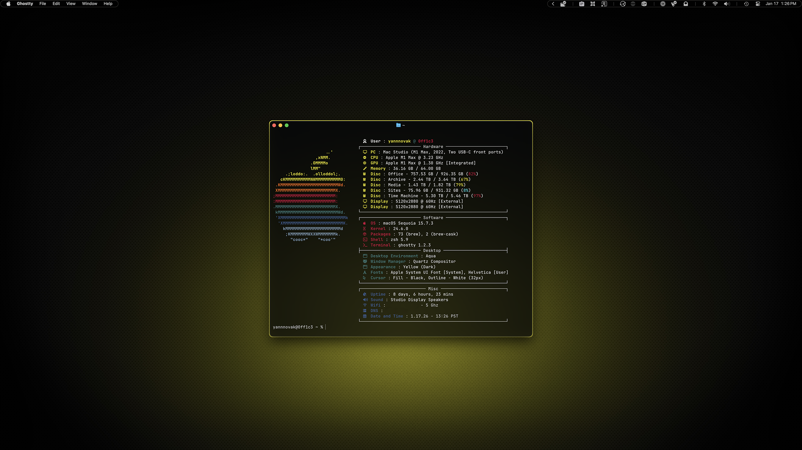
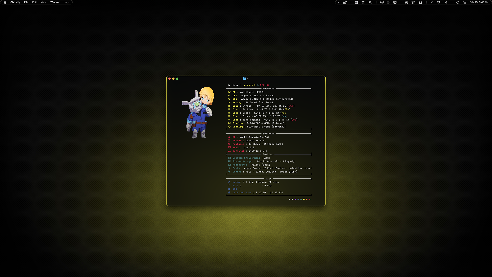
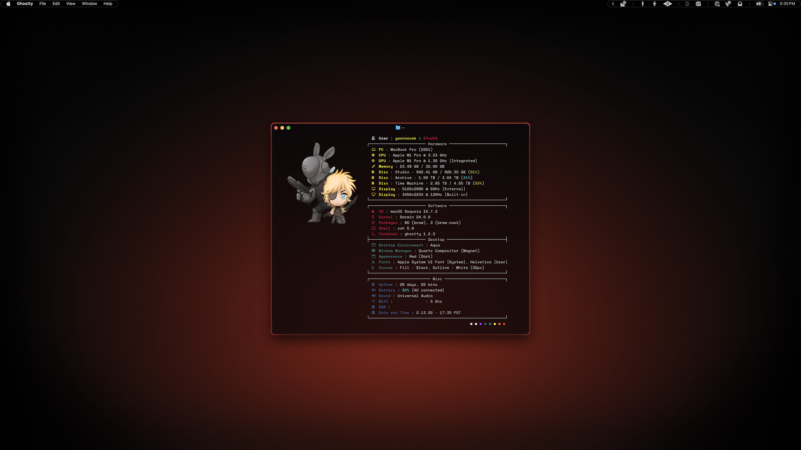

# Fastfetch

I referenced so many other dotfiles for the inspiration for this one that I can't quite remember them all. But because it was an icon here, a wording there, I do feel like this became my own thing. I had so much fun doing it I would encourage anyone doing this to really go deep and make it their own.

## Preview



<p align="center">
    Default (Included Config)
</p>
<br>



<p align="center">
    Yellow Variant (Example)
</p>
<br>



<p align="center">
    Red Variant (Example)
</p>


## Installation

### 00. Before you start
- Make sure Homebrew is installed ([install here](https://brew.sh))
- See [Installation Guide](../../INSTALL.md) if you haven't set up prerequisites yet
- [Fastfetch GitHub](https://github.com/fastfetch-cli/fastfetch)

### 01. Install fastfetch
```sh
brew install fastfetch
```

### 02. Create config directory
```sh
mkdir -p ~/.config/fastfetch
```

### 03. Copy config file
```sh
cp dotfiles/fastfetch/config.jsonc ~/.config/fastfetch/config.jsonc
```

### 04. Run fastfetch
```sh
fastfetch
```

## Customization Notes

The included config provides a clean starting point. The yellow and red screenshots show customized versions with the following modifications:

- **PC**: Custom hardware name (macOS doesn't provide clean model names by default)
- **Desktop Environment**: Custom "Aqua" label (macOS doesn't return DE info)
- **Window Manager**: Added custom window manager info after the default for specificity
- **Font**: macOS returns technical font names for the system font, so I used a custom format for the first to match the second font
- **Sound** (red variant only): I used custom format for my audio interface because of a software config that confused fastfetch

I encourage you to modify `config.jsonc` to match your specific hardware and preferences. You can learn more [here](https://github.com/fastfetch-cli/fastfetch/wiki/Configuration).

### Using a Custom Logo

To use your own PNG logo instead of the Apple ASCII:

01. Create a logo directory:
```sh
mkdir -p ~/.config/fastfetch/logo
```

02. Copy your logo (should be square with transparent background):
```sh
cp /path/to/your/logo.png ~/.config/fastfetch/logo/logo.png
```

03. Replace the logo section in `config.jsonc` with:
```jsonc
"logo": {
    "source": "~/.config/fastfetch/logo/logo.png",
    "type": "kitty-direct",
    "height": 15,
    "width": 30,
    "padding": {
        "top": 3,
        "left": 4
    }
}
```
