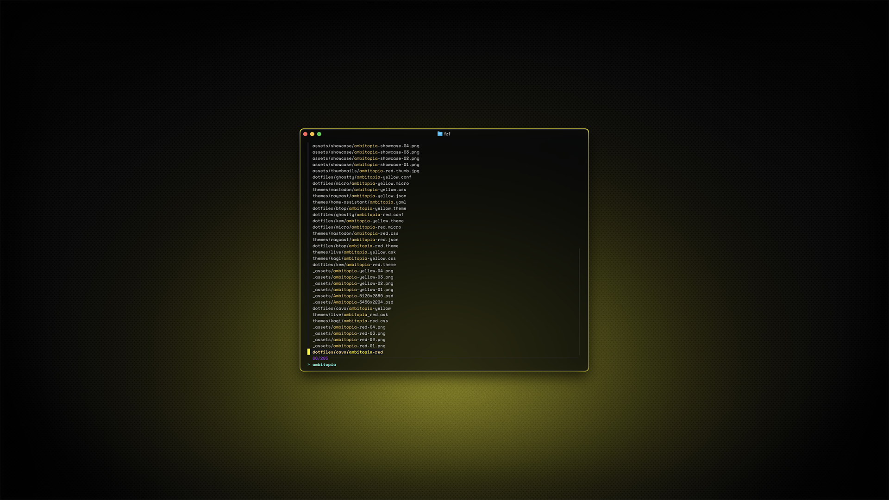
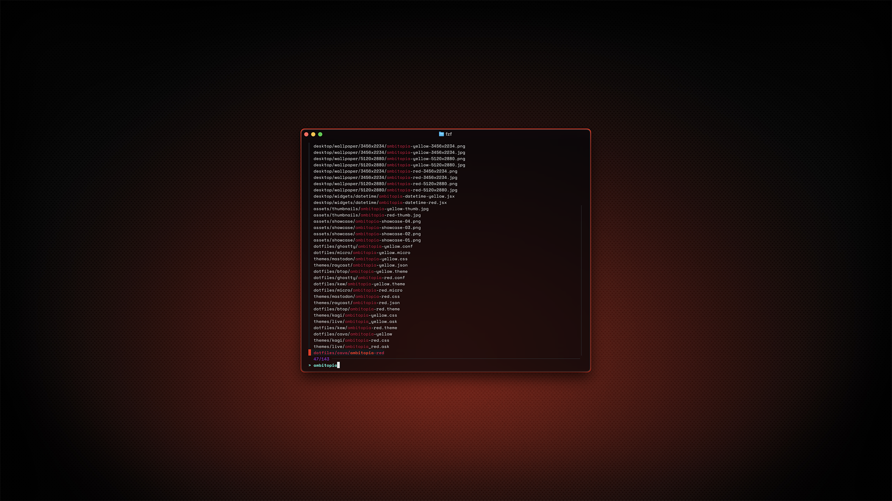

# fzf

I was lazy and just used the [fzf Theme Playground](https://vitormv.github.io/fzf-themes/) by [Vitor Mello](https://github.com/vitormv), so this one might not be as deep as it could be.

## Preview



<p align="center">
    Yellow Variant
</p>
<br>



<p align="center">
    Red Variant
</p>

## Installation

### 00. Before you start
- Make sure Homebrew is installed ([install here](https://brew.sh))
- If you skipped the Installation Guide, install Micro and SpaceMono Nerd Font (instructions [here](../../INSTALL.md)) or follow the whole [Installation Guide](../../INSTALL.md)
- [fzf GitHub](https://github.com/junegunn/fzf)

### 01. Install fzf
```sh
brew install fzf
```

### 02. Enable theme in Zsh

Open your Zsh config file:
```sh
micro ~/.zshrc
```

Add your chosen variant at the end of the file:

**For yellow variant:**
```sh
# Ambitopia [yellow]
export FZF_DEFAULT_OPTS=$FZF_DEFAULT_OPTS'
  --color=fg:#e3e3e3,fg+:#fcd670,bg:-1,bg+:#17181c
  --color=hl:#fcd670,hl+:#fdf400,info:#a537fd,marker:#fcd670
  --color=prompt:#55ead4,spinner:#454649,pointer:#fdf400,header:#397979
  --color=border:#2e2f32,label:#e3e3e3,query:#55ead4
  --preview-window="border-rounded" --prompt="> " --marker=">" --pointer="█"
  --separator="─" --scrollbar="│"'
```

**For red variant:**
```sh
# Ambitopia [red]
export FZF_DEFAULT_OPTS=$FZF_DEFAULT_OPTS'
  --color=fg:#e3e3e3,fg+:#c5003c,bg:-1,bg+:#17181c
  --color=hl:#c5003c,hl+:#f22613,info:#a537fd,marker:#c5003c
  --color=prompt:#55ead4,spinner:#454649,pointer:#f22613,header:#397979
  --color=border:#2e2f32,label:#e3e3e3,query:#55ead4
  --preview-window="border-rounded" --prompt="> " --marker=">" --pointer="█"
  --separator="─" --scrollbar="│"'
```

Save and close the file.

### 03. Open a new terminal window and launch fzf
```sh
fzf
```

> [!NOTE]
> - If you're switching variants, replace the existing block rather than adding a second one.