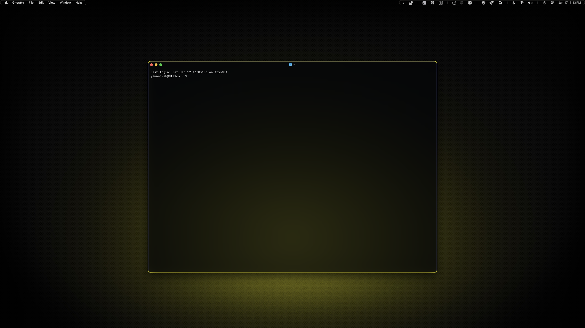

# Ghostty

A customizable terminal was essential for this project, and so far Ghostty is my favorite one. I wish creating themes was this easy for everything!

## Preview



<p align="center">
    Yellow Variant
</p>
<br>


<p align="center">
    Red Variant
</p>

## Installation

### 00. Before you start
- Make sure Homebrew is installed ([install here](https://brew.sh))
- If you skipped the Installation Guide, install SpaceMono Nerd Font (instructions [here](../../INSTALL.md)) or follow the whole [Installation Guide](../../INSTALL.md)
- [Ghostty GitHub](https://github.com/ghostty-org/ghostty)

### 01. Install Ghostty
```sh
brew install --cask ghostty
```

### 02. Create themes directory
```sh
mkdir -p ~/.config/ghostty/themes
```

### 03. Copy theme file

Choose your variant:

**For yellow variant:**
```sh
cp dotfiles/ghostty/ambitopia-yellow.conf ~/.config/ghostty/themes/
```

**For red variant:**
```sh
cp dotfiles/ghostty/ambitopia-red.conf ~/.config/ghostty/themes/
```

### 04. Configure theme

Open Ghostty and go to Settings, then add one of the following:

**For yellow variant:**
```
theme = ambitopia-yellow.conf
```

**For red variant:**
```
theme = ambitopia-red.conf
```

### 05. Restart Ghostty

The theme will apply after restarting Ghostty.

> [!NOTE]
> - I have the 'last login' message hidden, if you would like to hide it as well you can use this command: `touch ~/.hushlogin`.
> - To achieve the full look in the screenshots you also need to install [Starship](../../dotfiles/starship/README.md).
