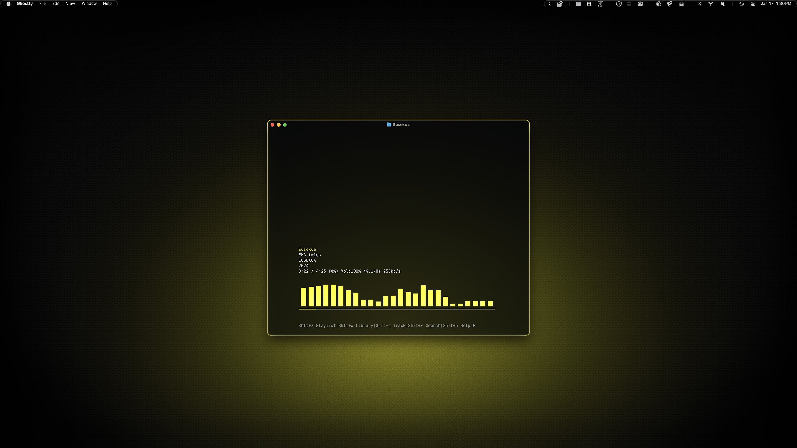
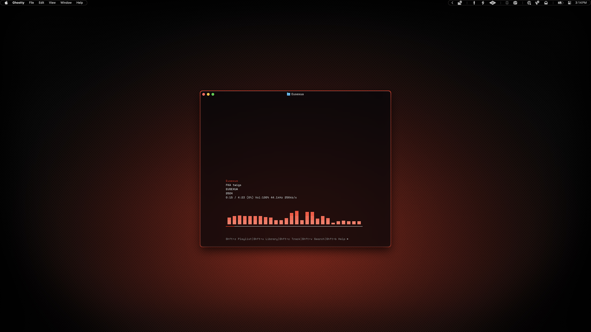

# Kew

This is another important part of my move away from Mac apps. I've used iTunes/Music for 25 years and have a huge collection, but it just gets worse and worse for folks like me with local libraries. I'm in the process of moving to Plex, but Plexamp leaves a lot to be desired GUI-wise. So this is my interim music player. In a perfect world it would access the Plex API and stream from there, but that might be something I need to build myself...

## Preview



<p align="center">
    Yellow Variant
</p>
<br>



<p align="center">
    Red Variant
</p>

## Installation

### 00. Before you start
- Make sure Homebrew is installed ([install here](https://brew.sh))
- See [Installation Guide](../../INSTALL.md) if you haven't set up prerequisites yet
- [Kew GitHub](https://github.com/ravachol/kew)

### 01. Install kew
```sh
brew install kew
```

### 02. Launch kew to create config directory
```sh
kew
```

### 03. Close kew

Press <kbd>Esc</kbd> to exit.

### 04. Copy theme file

Choose your variant:

**For yellow variant:**
```sh
cp dotfiles/kew/ambitopia-yellow.theme ~/Library/Preferences/kew/
```

**For red variant:**
```sh
cp dotfiles/kew/ambitopia-red.theme ~/Library/Preferences/kew/
```

### 05. Select the theme

**For yellow variant:**
```sh
kew theme ambitopia-yellow
```

**For red variant:**
```sh
kew theme ambitopia-red
```

### 06. Launch kew
```sh
kew
```

> [!WARNING]
> Ghostty does not support how Kew displays album art, but I actually prefer it that way. The cover art swapping can be distracting, and the minimal layout with open space above the track details creates a cleaner, more focused listening experience.
