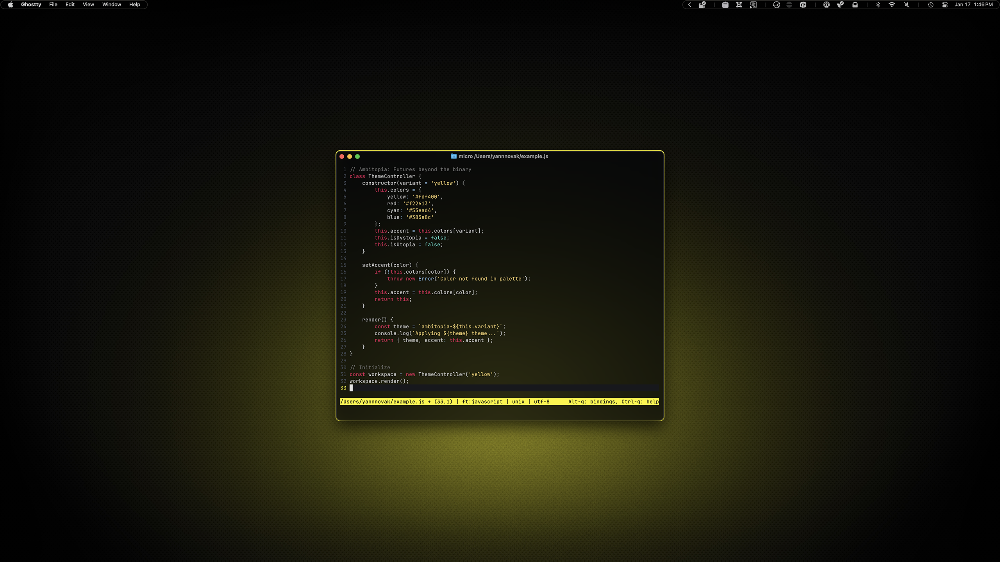
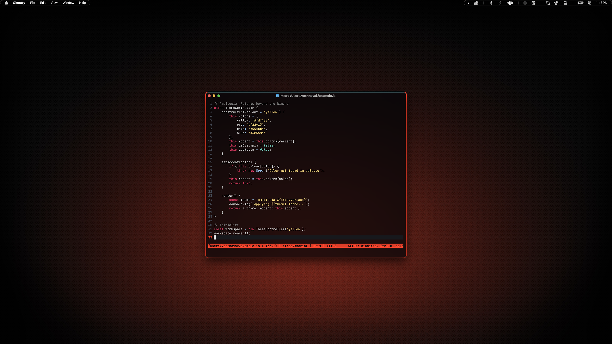

# Micro

To be honest, I haven't used Micro much, but I felt a tool like this might be easier for some Mac users than revealing hidden files and getting TextEdit to open them. Maybe this will work?

## Preview



<p align="center">
    Yellow Variant
</p>
<br>



<p align="center">
    Red Variant
</p>

## Installation 

### 00. Before you start
- Make sure Homebrew is installed ([install here](https://brew.sh))
- See [Installation Guide](../../INSTALL.md) if you haven't set up prerequisites yet
- [Micro GitHub](https://github.com/zyedidia/micro)

### 01. Install Micro
```sh
brew install micro
```

### 02. Create colorschemes directory
```sh
mkdir -p ~/.config/micro/colorschemes
```

### 03. Copy theme files

Choose your variant:

**For yellow variant:**
```sh
cp dotfiles/micro/ambitopia-yellow.micro ~/.config/micro/colorschemes/
```

**For red variant:**
```sh
cp dotfiles/micro/ambitopia-red.micro ~/.config/micro/colorschemes/
```

### 04. Configure theme

Create the settings file for your chosen variant:

**For yellow variant:**
```sh
echo '{"colorscheme": "ambitopia-yellow"}' > ~/.config/micro/settings.json
```

**For red variant:**
```sh
echo '{"colorscheme": "ambitopia-red"}' > ~/.config/micro/settings.json
```

### 05. Launch Micro
```sh
micro
```

> [!NOTE]
> Micro is a modern terminal text editor with intuitive keybindings (`Ctrl+S` to save, `Ctrl+Q` to quit, `Ctrl+E` for command mode). It's included in this dotfiles collection to provide an easy way to edit config files without leaving the terminal.
