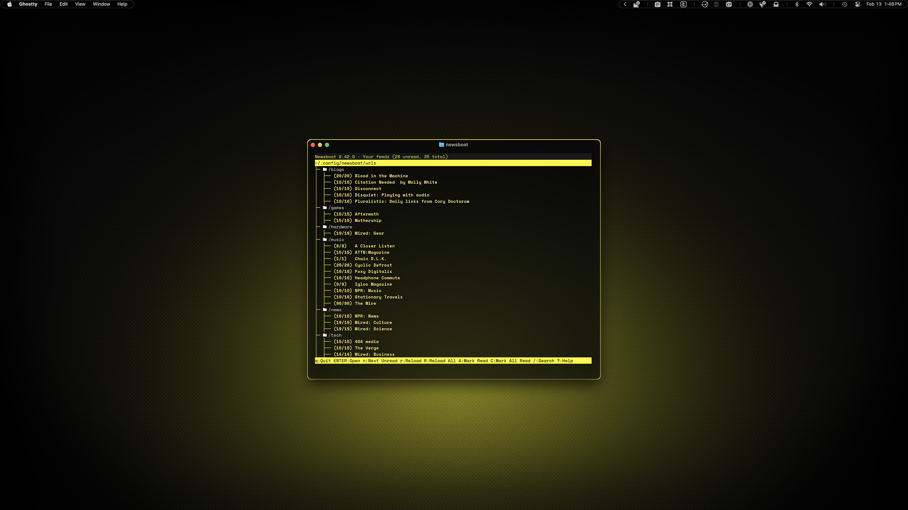

# Newsboat

My Newsboat theme is heavily inspired by [Cybrland](https://github.com/scherrer-txt/cybrland/tree/main/newsboat). I was unfamiliar with Newsboat until I saw it in Cybrland, but I have been looking for a private RSS reader to get me away from doomscrolling, and did not want to use the one built into Vivaldi because it's too close to other distractions. I leaned heavily on his theme because I had assumed that was the built-in functionality.

## Preview



<p align="center">
    Yellow Variant
</p>
<br>


<p align="center">
    Red Variant
</p>

## Installation

### 00. Before you start
- Make sure Homebrew is installed ([install here](https://brew.sh))
- If you skipped the Installation Guide, install Micro (instructions [here](../../INSTALL.md)) or follow the whole [Installation Guide](../../INSTALL.md)
- Ghostty theme required - install it first ([instructions](../../dotfiles/ghostty/README.md))
- [Newsboat GitHub](https://github.com/newsboat/newsboat)

### 01. Install Newsboat
```sh
brew install newsboat
```

### 02. Create config directory
```sh
mkdir -p ~/.config/newsboat
```

### 03. Create URLs file
```sh
touch ~/.config/newsboat/urls
```

### 04. Open URLs file
```sh
micro ~/.config/newsboat/urls
```

### 05. Add your feeds

Add your feeds in categories using the template below:
```
# Paste this section inside:
"~/.config/newsboat/urls"

# Tag Name
"query:├─  /tagname:tags # \"tagname\""
https://www.url.com/feed "~Pretty Name" "tagname"
```

### 06. Copy config file

Choose your variant:

**For yellow variant:**
```sh
cp dotfiles/newsboat/yellow/config ~/.config/newsboat/config
```

**For red variant:**
```sh
cp dotfiles/newsboat/red/config ~/.config/newsboat/config
```

### 07. Launch Newsboat
```sh
newsboat
```

> [!NOTE]
> The first line of the urls file added in step 05 (`"~/.config/newsboat/urls"`) is decorative and has no function - it just labels the file when viewed in Newsboat. It can be skipped or changed without affecting functionality.
