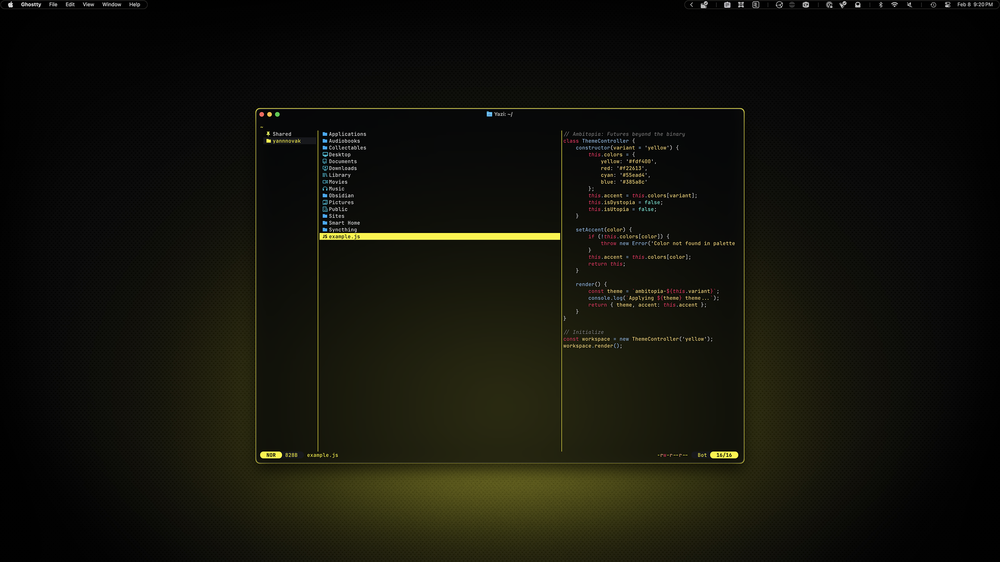
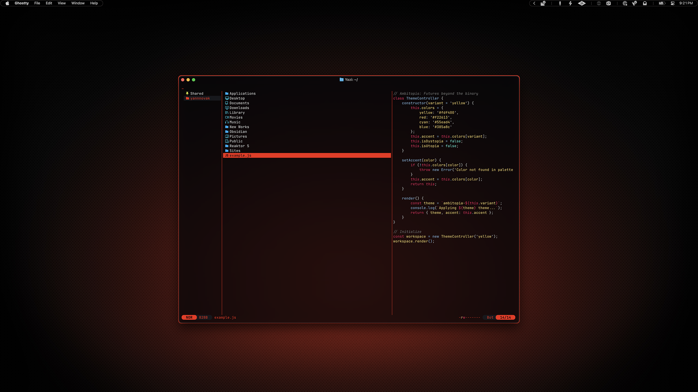

# Yazi

I am not one of those people that 'lives in the terminal,' but I think Finder is one of the worst implementations of Liquid Glass, so I am experimenting with other file browsers. I relied heavily on [Cybrland](https://github.com/scherrer-txt/cybrland/tree/main/yazi) for the icons in my theme.

## Preview



<p align="center">
    Yellow Variant
</p>
<br>



<p align="center">
    Red Variant
</p>

## Installation

### 00. Before you start
- Make sure Homebrew is installed ([install here](https://brew.sh))
- If you skipped the Installation Guide, install SpaceMono Nerd Font (instructions [here](../../INSTALL.md)) or follow the whole [Installation Guide](../../INSTALL.md)
- [Yazi GitHub](https://github.com/sxyazi/yazi)

### 01. Install Yazi
```sh
brew install yazi
```

### 02. Create config directories
```sh
mkdir -p ~/.config/yazi/flavors
```

### 03. Create theme file
```sh
touch ~/.config/yazi/theme.toml
```

### 04. Copy flavor folder

Choose your variant:

**For yellow variant:**
```sh
cp -r dotfiles/yazi/ambitopia-yellow.yazi ~/.config/yazi/flavors/
```

**For red variant:**
```sh
cp -r dotfiles/yazi/ambitopia-red.yazi ~/.config/yazi/flavors/
```

### 05. Set your flavor

Open the theme file:
```sh
micro ~/.config/yazi/theme.toml
```

Add your chosen variant:

**For yellow variant:**
```toml
[flavor]
dark = "ambitopia-yellow"
```

**For red variant:**
```toml
[flavor]
dark = "ambitopia-red"
```

Save and close the file.

### 06. Launch Yazi
```sh
yazi
```
