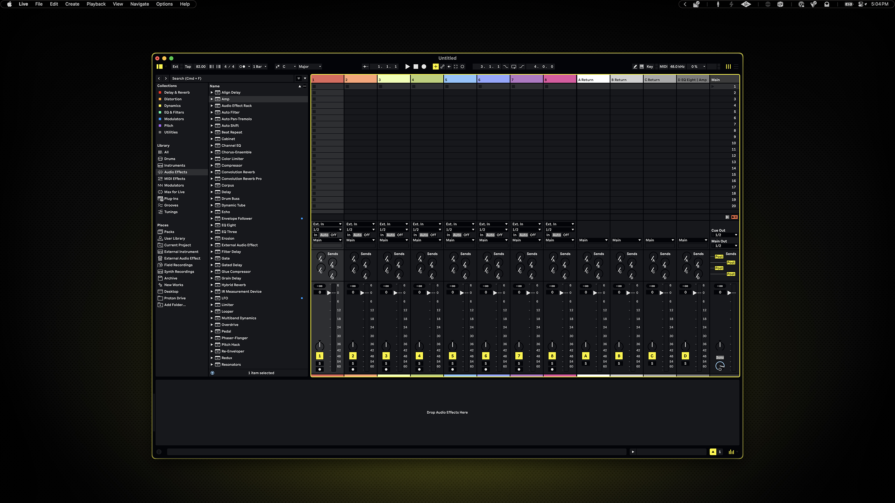
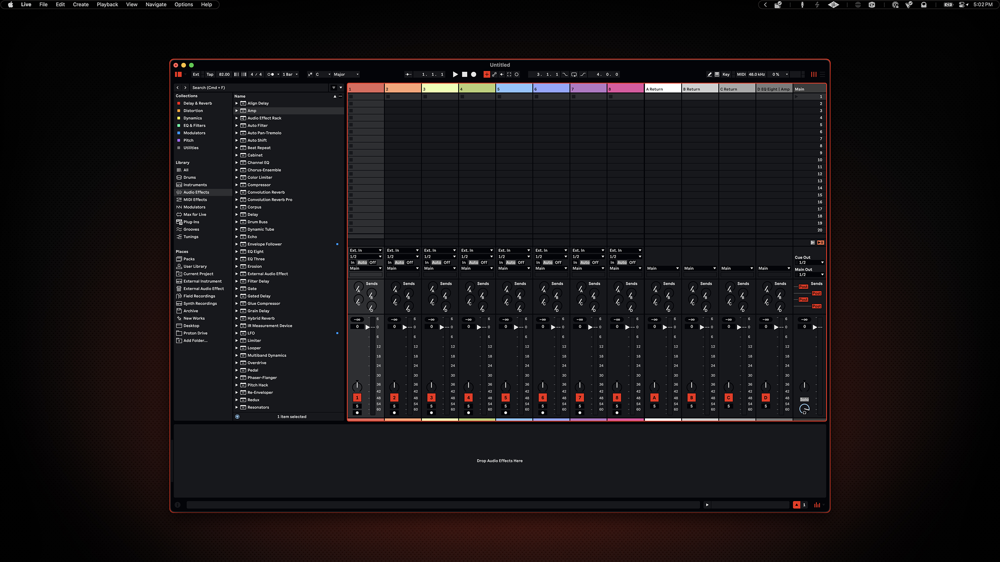

# Ableton Live

Making a custom theme for Live has been on my bucket list. Really happy I got this one started, but as I use it I suspect I will refine it further. The track colors Live or a user can assign cannot be changed, so I left the colors I had been using in the previous theme for the preview.

## Preview



<p align="center">
    Yellow Variant
</p>
<br>



<p align="center">
    Red Variant
</p>

## Installation

### 00. Before you start
- Ableton Live 12 required
- These themes are also available on LiveThemes in [yellow](https://livethemes.app/theme/b93e7607-268f-41af-acad-cf910dba9a04) and [red](https://livethemes.app/theme/2cd0859c-1145-4a3b-8f89-4971161abba7)
- [Ableton Live](https://www.ableton.com/)

### 01. Locate Ableton Live application

Find the Ableton 12 application in your Applications folder, right-click on it and select **Show Package Contents**.

### 02. Navigate to Themes folder

Inside the package contents, navigate to:
```
Contents → App-Resources → Themes
```

### 03. Copy theme file

**For yellow variant:**
```sh
cp themes/live/ambitopia_yellow.ask /Applications/Ableton\ Live\ 12.app/Contents/App-Resources/Themes/
```

Or drag and drop `ambitopia-yellow.ask` into the Themes folder.

**For red variant:**
```sh
cp themes/live/ambitopia_red.ask /Applications/Ableton\ Live\ 12.app/Contents/App-Resources/Themes/
```

Or drag and drop `ambitopia-red.ask` into the Themes folder.

### 04. Restart Ableton Live Settings

If Ableton is open, close and reopen the Settings window.

### 05. Select theme

Go to Settings → Theme & Colors and select your Ambitopia theme from the dropdown.
