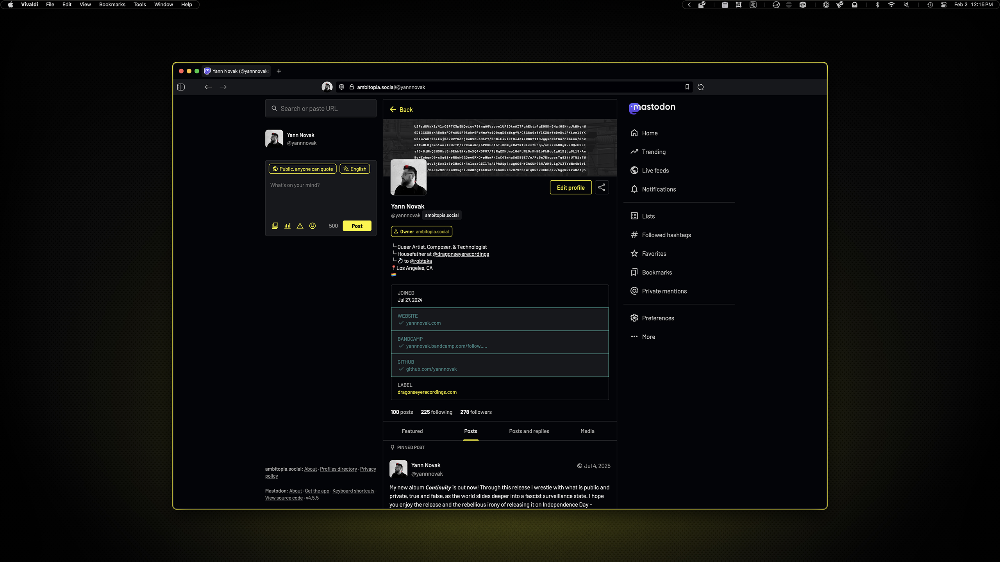
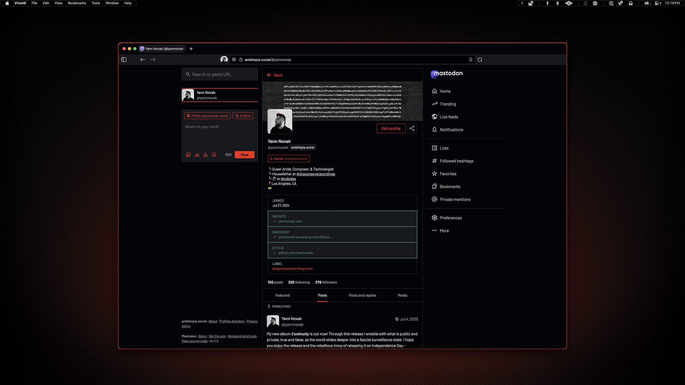

# Mastodon

I run my own Mastodon instance for myself and a few friends, and because it's [ambitopia.social](https://ambitopia.social/) I thought I should create a theme for it. However, I have a managed Mastodon instance from [MastoHost](https://masto.host) so I can't install a full theme. Instead, I took the approach of just using the Custom CSS feature for my instance. Once it was done, I realized anyone could deploy it via a browser plugin.

## Preview

    Yellow Variant

 

    Red Variant

## Installation

### 00. Before you start
- You may need to enable the Mastodon (Dark) theme if possible.
- [Mastodon](https://joinmastodon.org/)

### Choose your installation method:

<b>Method A: Instance Admin (Server-Wide)</b>

If you run your own Mastodon instance, you can apply this theme server-wide.

#### 01. Open Preferences

Go to Preferences → Administration → Server Settings → Appearance

#### 02. Paste theme code

Choose your variant, then copy and paste the contents into the Custom CSS field.

**Yellow variant:** [ambitopia-yellow.css](ambitopia-yellow.css)

**Red variant:** [ambitopia-red.css](ambitopia-red.css)

#### 03. Save changes

Click **Save** to apply the theme server-wide.

<b>Method B: Personal Use (Browser Extension)</b>

If you're using someone else's instance, you can apply this theme just for yourself using Stylus.

#### 01. Install Stylus browser extension

**For Vivaldi/Chrome:**
Install [Stylus](https://chrome.google.com/webstore/detail/stylus/clngdbkpkpeebahjckkjfobafhncgmne) from the Chrome Web Store

**For Firefox:**
Install [Stylus](https://addons.mozilla.org/en-US/firefox/addon/styl-us/) from Firefox Add-ons

#### 02. Create new style

Click the Stylus extension icon → **Manage** → **Write new style**

#### 03. Paste theme code

Choose your variant, then copy and paste the contents into the code editor.

**Yellow variant:** [ambitopia-yellow.css](ambitopia-yellow.css)

**Red variant:** [ambitopia-red.css](ambitopia-red.css)

#### 04. Set URL pattern

In the "Applies to" section, select **URLs on the domain** and enter your Mastodon instance domain (e.g., `mastodon.social`)

#### 05. Save and apply

Give your style a name (e.g., "Ambitopia Yellow") and click **Save**

> [!NOTE]
> - Because my instance is a vanilla Mastodon instance, this should work across most instances unless your admin has made their own theme or their own CSS modifications.
> - I have not optimized this yet because I am still working on it and making changes, but I will eventually streamline it substantially.