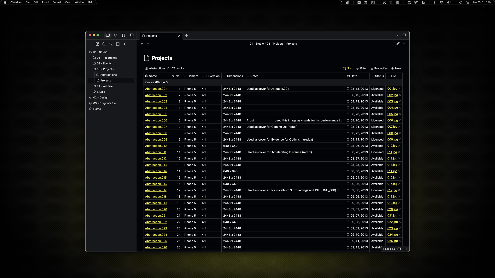
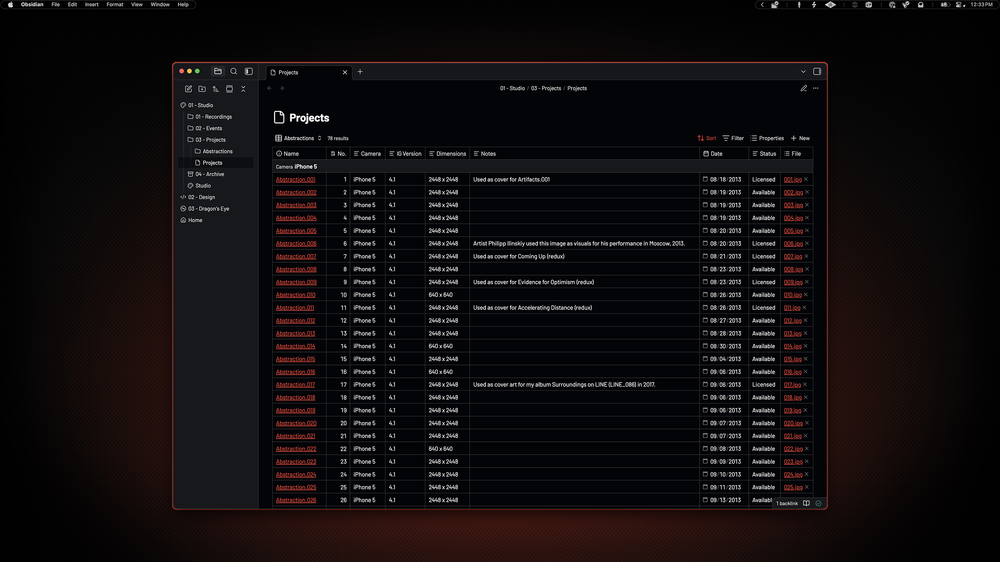

# Obsidian                                                                

I am using Obsidian as a replacement for Notion, so there may be some sections of the app that are neglected, but I tried to just change colors so it would be consistent across all use-cases. I use [Iconic](https://github.com/gfxholo/iconic) to add icons to my folders and files. I felt the theme would be more useful to others without my hyper-specific section icons hard coded.

**Version:** 1.0.0

## Preview



<p align="center">
    Yellow Variant
</p>
<br>



<p align="center">
    Red Variant
</p>

## Installation

### 00. Before you start
- Make sure Homebrew is installed ([install here](https://brew.sh))
- See [Installation Guide](../../INSTALL.md) if you haven't set up prerequisites yet
- [Obsidian](https://obsidian.md/)

### 01. Install Obsidian
```sh
brew install --cask obsidian
```

### 02. Open Obsidian theme folder

Go to Obsidian Settings → Appearance → Themes

Click the folder icon (📁) to open the themes folder

### 03. Copy theme folder

Drag the `ambitopia` folder from `themes/obsidian/` into the opened themes folder.

### 04. Activate theme

Go to Obsidian Settings → Appearance → Current community themes

Click the **Check for updates** button, then select **Ambitopia** from the Themes dropdown.

### 05. Set accent color

Go to Obsidian Settings → Appearance → Accent color

Choose your variant using either the RGB values or the eyedropper tool:

**Yellow variant:**
- RGB: `253, 244, 0`
- Or use eyedropper on: 

**Red variant:**
- RGB: `242, 38, 19`
- Or use eyedropper on: 

> [!NOTE]
> This theme differs from other themes as it does not explicitly set the accent colors. Instead, I used the built-in accent color picker because I thought it would scale better this way.
