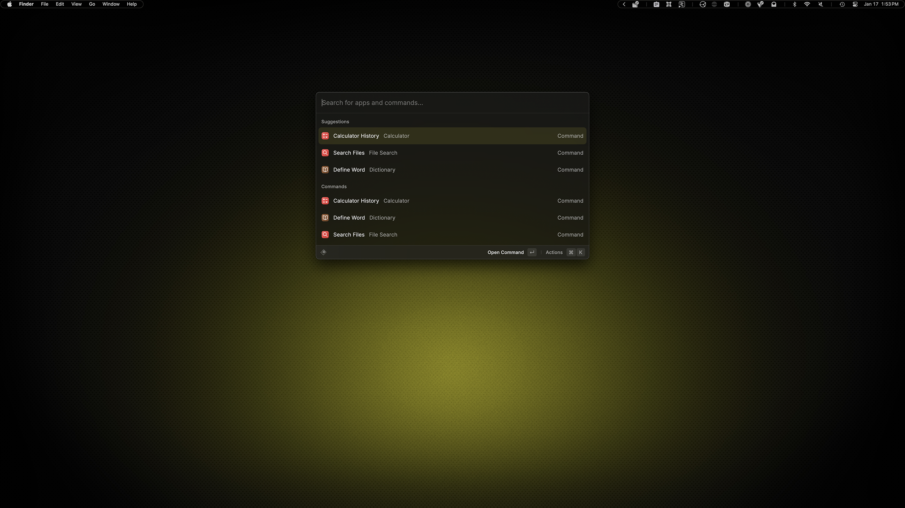
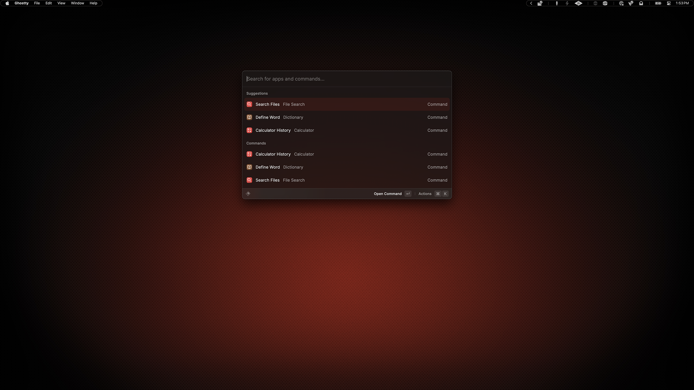

# Raycast

Raycast's theming system provides 12 color values, but will automatically adjust them if it considers them "off brand", I almost did not include it because of this. I created these on a 2-week trial because you must have a paid subscription to use Raycast's Theme Studio and I already canceled because I was just not happy with the results enough to continue to pay.

## Preview



<p align="center">
    Yellow Variant
</p>
<br>



<p align="center">
    Red Variant
</p>

## Installation

### 00. Before you start
- Make sure Homebrew is installed ([install here](https://brew.sh))
- See [Installation Guide](../../INSTALL.md) if you haven't set up prerequisites yet
- [Raycast](https://www.raycast.com/)

### 01. Install Raycast
```sh
brew install --cask raycast
```

### 02. Configure theme colors

Choose your variant:

Open Raycast Settings → General → Open Theme Studio

Manually enter the color values from:

**Yellow variant:** [ambitopia-yellow.json](ambitopia-yellow.json)

**Red variant:** [ambitopia-red.json](ambitopia-red.json)

### 03. Save the theme

Click **Save** in the Theme Studio

### 04. Apply your theme

Close Theme Studio and select your new theme from the dropdown

> [!WARNING]
> - The included JSON files are provided for reference only, as Raycast offers no import functionality. 
> - This barely qualifies as a theme, but I included it here for anyone who wants to use it.
