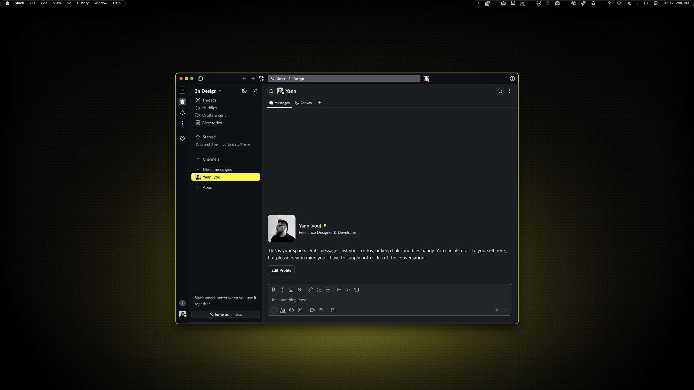
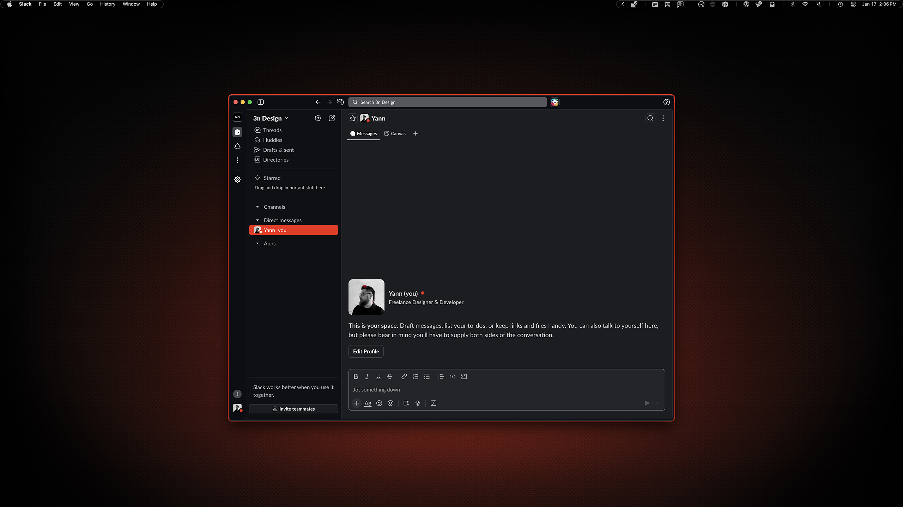

# Slack

I almost didn't include this because Slack's theming is limited, but it gets closer than Raycast, so I included it. 

## Preview



<p align="center">
    Yellow Variant
</p>
<br>



<p align="center">
    Red Variant
</p>

## Installation

### 00. Before you start
If you have to use Slack for work and already have it installed, you're all set. If not, honestly, you're probably better off.
- [Slack](https://slack.com/)

### 01. Open Slack theme settings

Go to **Settings → Appearance → Import Theme**

### 02. Paste theme code

Choose your variant:

**For yellow variant:**
```
#030408,#17181c,#fdf400,#e3e3e3,#17181c,#e3e3e3,#fdf400,#fdf400,#17181c,#e3e3e3
```

**For red variant:**
```
#030408,#17181c,#f22613,#e3e3e3,#17181c,#e3e3e3,#f22613,#f22613,#17181c,#e3e3e3
```

> [!NOTE]
> - This theme format is for Slack's classic theme builder (10 colors).
> - It will still work even if Slack only asks for 4 colors - just paste the whole string.
> - Theme settings are workspace-dependent, so you'll need to apply this to each workspace separately.
