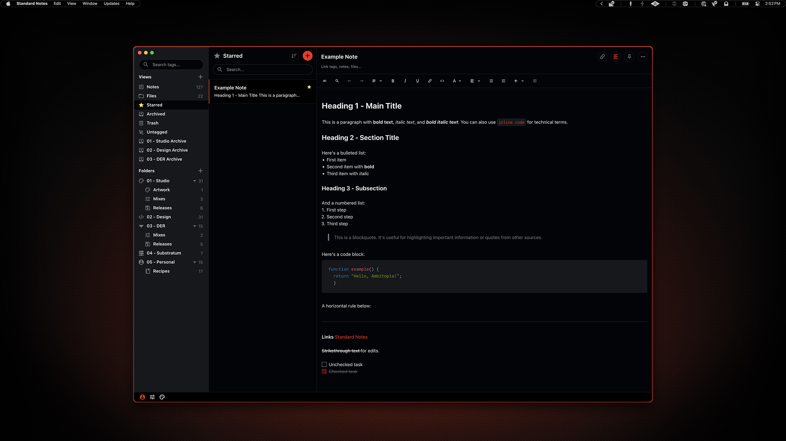

# Standard Notes

Standard Notes was the most important theme in Ambitopia because I spend so much time using it, so I spent the most time on it. That said, I still need to get its syntax highlighting inline with the rest of the system, but it's close.

**Version \[Yellow\]:** 1.0.9  
**Version \[Red\]:** 1.0.2

## Preview


<p align="center">
    Yellow Variant
</p>
<br>



<p align="center">
    Red Variant
</p>

## Installation

### 00. Before you start
- Standard Notes can be installed from their website or via Homebrew
- These themes are externally hosted due to Standard Notes' requirement for GitHub-published extensions
- [Standard Notes](https://standardnotes.com/)

### 01. Install Standard Notes (optional)
```sh
brew install --cask standard-notes
```

### 02. Install theme

Go to Standard Notes Preferences → Plugins

Enter the URL below under "Install Custom Plugin" and click install.

Choose your variant:

**For yellow variant:**
```
https://cdn.jsdelivr.net/gh/yannnovak/sn-ambitopia-yellow-theme@main/ext.json
```

**For red variant:**
```
https://cdn.jsdelivr.net/gh/yannnovak/sn-ambitopia-red-theme@main/ext.json
```

### 03. Activate theme

Go to Preferences → Appearance and select "Ambitopia" from the theme dropdown.

> [!NOTE]
> Full theme source code and development files are available in the individual repositories:
> - [sn-ambitopia-yellow-theme](https://github.com/yannnovak/sn-ambitopia-yellow-theme)
> - [sn-ambitopia-red-theme](https://github.com/yannnovak/sn-ambitopia-red-theme)
