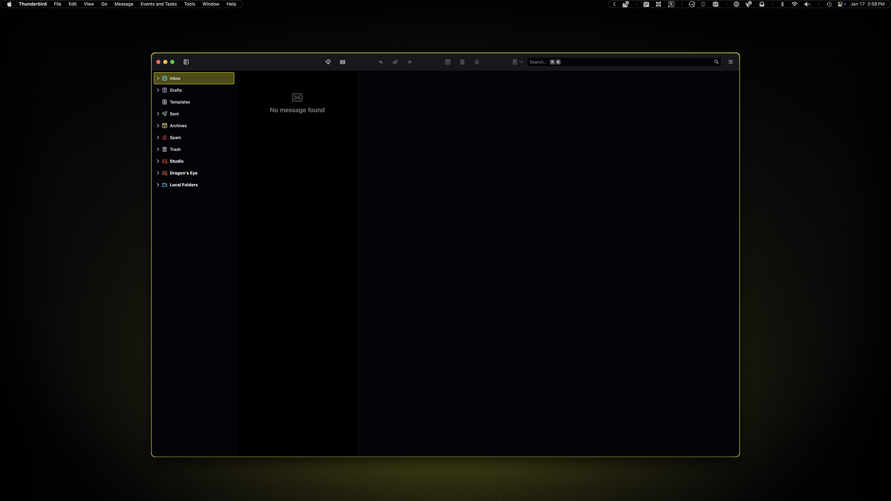
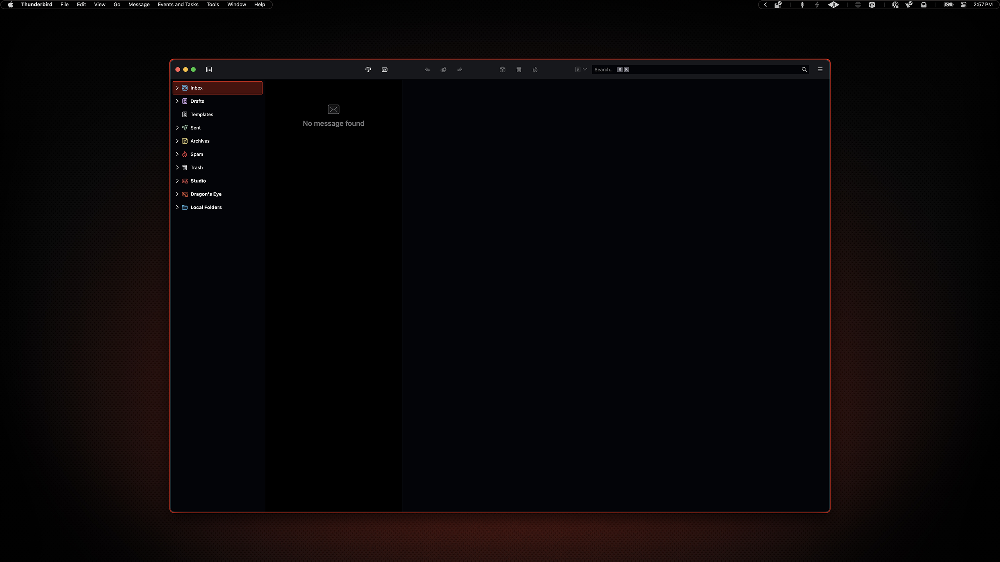

# Thunderbird

This was the second theme I created after Vivaldi. I originally based it on another theme but can't remember which one—my first attempt failed miserably, and by the time I revisited it at the end of the project, I'd lost the source. I essentially rewrote it from scratch, so the missing attribution shouldn't be an issue.

> [!CAUTION]
> This theme is a work in progress; I only use Thunderbird for email, so I have not tested the calendar or chat panes yet. I am also having trouble targeting some button labels.

## Preview



<p align="center">
    Yellow Variant
</p>
<br>



<p align="center">
    Red Variant
</p>

## Installation

### 00. Before you start
- Make sure Homebrew is installed ([install here](https://brew.sh))
- See [Installation Guide](../../INSTALL.md) if you haven't set up prerequisites yet
- [Thunderbird](https://www.thunderbird.net/)

### 01. Install Thunderbird
```sh
brew install --cask thunderbird
```

### 02. Navigate to themes

Open Thunderbird Settings → Add-ons and Themes → Themes

### 03. Import theme

Click the gear icon (⚙) and select Install Add-on From File...

Choose your variant:

**For yellow variant:**
Select `tb-ambitopia-yellow.xpi`

**For red variant:**
Select `tb-ambitopia-red.xpi`

### 04. Activate theme

Click **Add** and **OK** when prompted.

The imported theme should automatically activate. If not, click "Enable" next to the Ambitopia theme in the Themes list.
