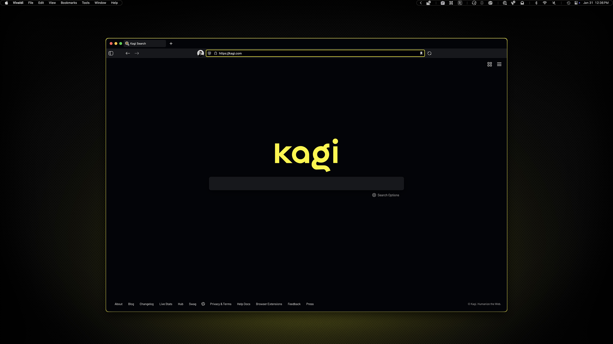
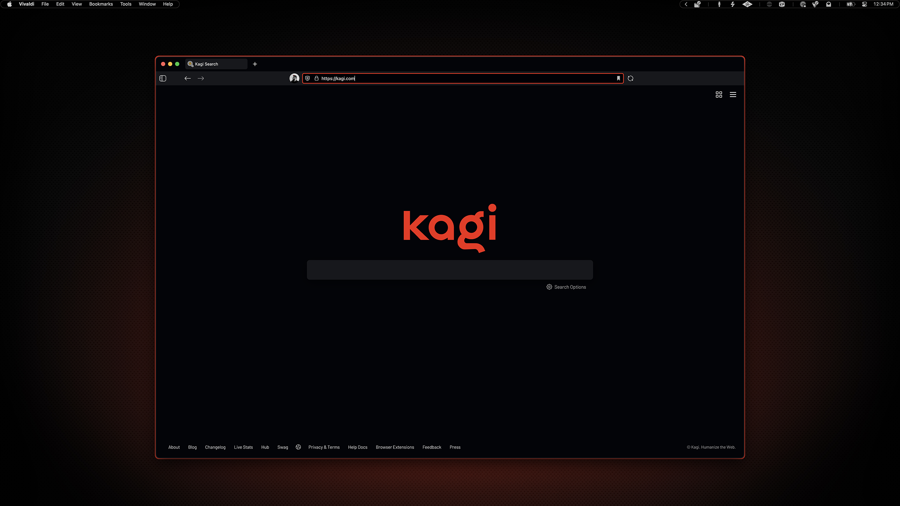

# Vivaldi

This is where Ambitopia started. I used Safari as my default browser for years but kept a Chromium browser for testing. When liquid glass was introduced, I knew I'd need to leave Safari, so I consolidated to one Chromium browser. For privacy reasons I avoid Chrome, and I avoid Brave because of who funds it, so Vivaldi felt like a happy medium. After the switch, I had a ton of fun with its transformative theme options—once I had it just right, I started looking for ways to extend the aesthetic to other apps.

## Preview



<p align="center">
    Yellow Variant
</p>
<br>



<p align="center">
    Red Variant
</p>

## Installation

### 00. Before you start
- Make sure Homebrew is installed ([install here](https://brew.sh))
- See [Installation Guide](../../INSTALL.md) if you haven't set up prerequisites yet
- [Vivaldi](https://vivaldi.com/)

### 01. Install Vivaldi
```sh
brew install --cask vivaldi
```

### 02. Import theme

Open Vivaldi Settings → Themes → Import Theme...

**For yellow variant:**
Select `vv-ambitopia-yellow.zip`

**For red variant:**
Select `vv-ambitopia-red.zip`

### 03. Activate theme

The imported theme should automatically activate. If not, select "Ambitopia \[yellow\]" or "Ambitopia \[red\]" from the theme grid.
