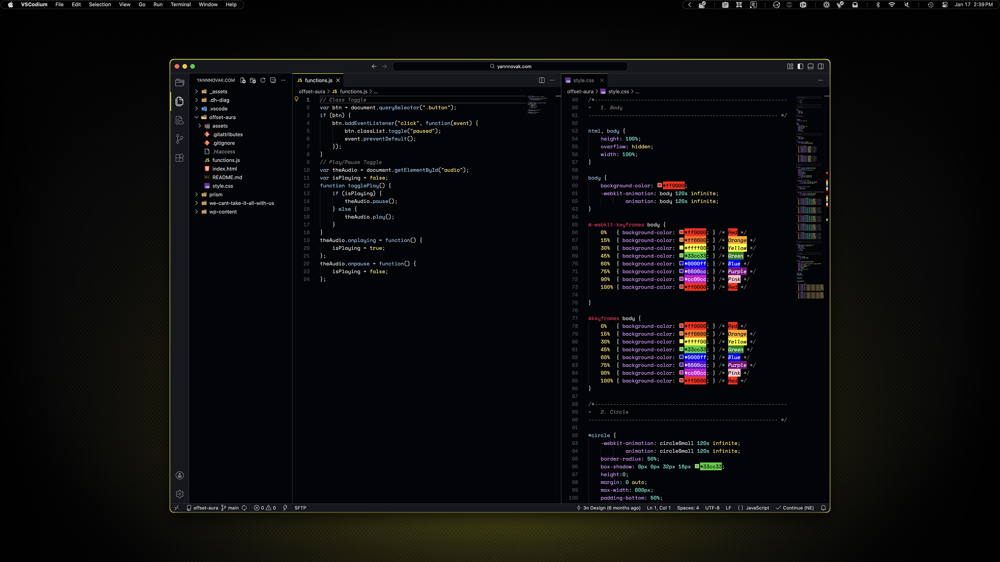
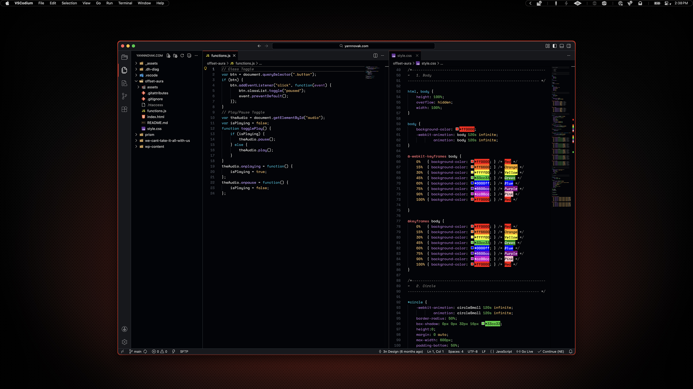

# VS Code / VSCodium

My VS Code theme is based on [Dreamweaver Dark Theme Modern](https://github.com/amnweb/Dreamweaver-Dark-Theme). I used Dreamweaver far longer than I should have (10+ years), and when I moved to a modern IDE I wanted the syntax highlighting to match to make the transition smoother. The Ambitopia version is completely transformed, but basing it this way allowed me to keep some of the syntax highlighting I was used to, even if it's in my color palette now.

**Version:** 1.0.0

## Preview



<p align="center">
    Yellow Variant
</p>
<br>



<p align="center">
    Red Variant
</p>

## Installation

### 00. Before you start
- Make sure Homebrew is installed ([install here](https://brew.sh))
- See [Installation Guide](../../INSTALL.md) if you haven't set up prerequisites yet
- Works with both [VS Code](https://code.visualstudio.com/) and [VSCodium](https://vscodium.com)

### 01. Install VS Code or VSCodium
```sh
brew install --cask visual-studio-code
```
or
```sh
brew install --cask vscodium
```

### 02. Copy theme extension

**For VS Code:**
```sh
cp -r themes/vscode/yannnovak.ambitopia-dark-theme-1.0.0 ~/.vscode/extensions/
```

**For VSCodium:**
```sh
cp -r themes/vscode/yannnovak.ambitopia-dark-theme-1.0.0 ~/.vscode-oss/extensions/
```

### 03. Restart VS Code/VSCodium

### 04. Apply theme

Open Command Palette (`Cmd+Shift+P`) and select "Preferences: Color Theme", then choose:

**For yellow variant:**
- Ambitopia \[yellow\]

**For red variant:**
- Ambitopia \[red\]
